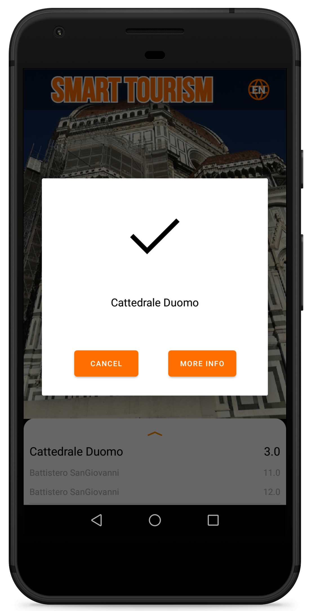
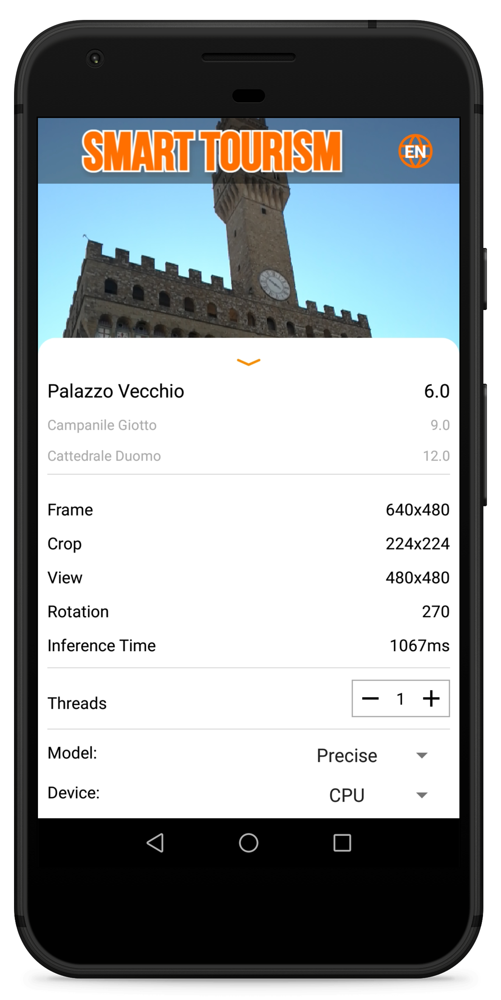
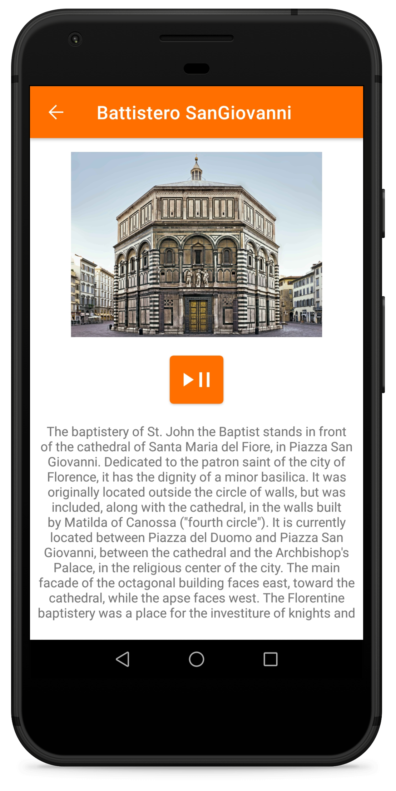

<a name="readme-top"></a>

<!-- PROJECT LOGO -->
<br />
<div align="center">
  <a href="https://github.com/lorenzo-massa/SmartTourism">
    
  </a>

  <p align="center">
    Image recognition for android devices
    <br />
    <a href="https://github.com/lorenzo-massa/SmartTourism"><strong>Explore the docs »</strong></a>
    <br />
    <br />
    <a href="https://github.com/lorenzo-massa/SmartTourism/issues">Report Bug</a>
    ·
    <a href="https://github.com/lorenzo-massa/SmartTourism/issues">Request Feature</a>
  </p>
</div>

<!-- @eliainnocenti -->


<!-- TABLE OF CONTENTS -->
<details>
  <summary>Table of Contents</summary>
  <ol>
    <li>
      <a href="#about-the-project">About The Project</a>
      <ul>
        <li><a href="#original-project">Original Project</a></li>
        <li><a href="#key-features">Key Features</a></li>
      </ul>
    </li>
    <li><a href="#getting-started">Getting Started</a></li>
    <li><a href="#usage">Usage</a></li>
    <li><a href="#contact">Contact</a></li>
  </ol>
</details>

<!-- ABOUT THE PROJECT -->
## About The Project

This fork is a project for my Bachelor's Degree in Computer Engineering at the University of Florence. 
The project is a mobile application that uses object detection to recognize monuments and provide information about them. 
The application is based on the original project [SmartTourism](https://github.com/mbertini/ReInHerit-SmartTourism) 
(there is also a second version of the application [SmartTourism v2](https://github.com/lorenzo-massa/SmartTourism-Image-Recognition-Android)).
The main difference between the original project and this fork is the use of a different computer vision technique, 
in fact the original project uses image retrieval while this fork uses object detection.

### Key Changes

- **Object Detection:** Replaced the original image retrieval method with object detection, which is believed to perform better in certain scenarios.
- **Custom TFLite Model:** The object detection model is a TensorFlow Lite model trained specifically for this application. The model was trained using a dataset that I personally curated, [Florence1k](https://github.com/eliainnocenti/Florence1k).
- **MediaPipe Integration:** Utilized MediaPipe for training and model optimization to enhance real-time performance on Android devices.

### Original Project
<details>
<!--<summary style="font-size: 1.3em; font-weight: bold;"> Original SmartTourism README.md </summary>-->
<summary>Click to toggle the original README</summary>

<!-- ORIGINAL README CONTENT -->

## Getting Started
<div align="center">
   &nbsp; &nbsp; &nbsp;  &nbsp; &nbsp; &nbsp; 
</div>

### APK
You will find the APK in `app/build/outputs/apk/support/debug` . 

If you wanto to generate another APK file take a look on the following guide: https://code.tutsplus.com/tutorials/how-to-generate-apk-and-signed-apk-files-in-android-studio--cms-37927

### Guide
The repository consists of two parts:
* Python
  * Android

The python part is used to generate sqlite files from an image dataset. You should use and edit this part only if you want to use another neural network or image dataset.
The android application is ready to use and you should change it just to add files to the monuments guides.

You will find all the instuction you need just below.

### Prerequisites

Python library required:
* numpy
  * cv2
  * tflite
  * faiss (Anaconda required)
  * sklearn

## Database creation
The repository contains the file `Python/build_sqlite.py` which must be executed by adding the argument `-i` or `--images` indicating the path to the dataset folder as in the following example:

```sh
python build_sqlite.py -i datasetFolder
```

IMPORTANT: The indicated folder must contains one folder per monument and each of which contains the images, as in the following example:

```

datasetFolder
├───Battistero_SanGiovanni
│       img1.jpg
│       img2.jpg
│       img3.jpg
│
├───Campanile_Giotto
│       img1.jpg
│       img2.jpg
│       img3.jpg
│
├───Cattedrale_Duomo
│       img1.jpg
│       img2.jpg
│       img3.jpg
│
└───Palazzo_Vecchio
       img1.jpg
       img2.jpg
       img3.jpg

```

The file `build_sqlite.py` will create three `.sqlite` and `.pck` files. Each pair of files is created with a different neural network. To change the neural network see dedicated paagraph.

IMORTANT: Do not change the names of the files created.

## Add test and images for monument guide
Go to the `models\src\main\assets\guides` folder. Inside it there is the folder `Template Monument` which is to be used as a template, so without altering its structure. It is only possible to change the name of the folder with the name of the monument which, however, must be the same uilized in the dataset folder.</br>
Text file and an image can be placed in this folder. Text file must be placed in the folder corresponding to the language.

IMPORTANT: New files must have the same name as the files in the template folder.

NOTE: For the time being, Italian and English languages are supported.

## Add video and audio for the monument guide
Audio and video files are played providing an URL.

IMPORTANT: If you want to add an audio or a video to the guide, first of all you have to upload the file on a drive platform (ex. Dropbox).

Open `app/src/main/java/org/tensorflow/lite/examples/classification/GuideActivity.java`.
Add a case to the switch construct with the name of the monument (must be the same as the name of the dataset folder), and replace `pathVideo` and `pathAudio` with the URL of the new files, as in the example:
```java
case "Palazzo Vecchio":
                if(language.equals("English"))
                    pathVideo += "https://driveexample.com/xxx/videoEn.mp4";
                    pathAudio += "https://driveexample.com/xxx/audioEn.mp4";
                else
                    pathVideo += "https://driveexample.com/xxx/videoEn.mp4";
                    pathAudio += "https://driveexample.com/xxx/audioIt.mp4";
                break;
```

### ONLY FOR EXPERT USERS

## Creating the database with different neural networks
Place the neural network model `.tflite` in `Models/src/main/assets`.
Open the file `build_sqlite.py`: add the name of the neural network and the model path to the "types" list. Example:

```python
types = [ #neural networks
    ('MobileNetV3_Large_100', '../models/src/main/assets/lite-model_imagenet_mobilenet_v3_large_100_224_classification_5_default_1.tflite'), 
    ('MobileNetV3_Large_075', '../models/src/main/assets/lite-model_imagenet_mobilenet_v3_large_075_224_classification_5_default_1.tflite'),
    ('MobileNetV3_Small_100', '../models/src/main/assets/lite-model_imagenet_mobilenet_v3_small_100_224_classification_5_default_1.tflite'),
    ('newNeuralNetworkModel.tflite', 'pathNewNeauralNetworkModel.tflite')
]
```

Run 'build_sqlite.py'.

## Using a database created with a different neural network
Go to `lib_support\src\main\java\org\tensorflow\lite\examples\classification\tflite`.
1) Create a class that extends the `Classifier` class with a name that indicates the new neural network.
TIP: There is a template class named `ClassifierNewNeuralNetworkClass`. Rename the class and change the `getModelPath()` method with the filename of the new neural network.
   2) Modify the file `Classifier.java` by adding a name indicating the new model as in the example:

```java
/** The model type used for classification. */
  public enum Model {
    MOBILENET_V3_LARGE_100,
    MOBILENET_V3_LARGE_075,
    MOBILENET_V3_SMALL_100,
    NEWMODEL_NAME
  }
```
3) Modify the `create(Activity, Model, Device, int)` method by adding an else if with the previously created class and model:

```java
if (model == Model.MOBILENET_V3_LARGE_100) {
      return new ClassifierMobileNetLarge100(activity, device, numThreads);
    } else if (model == Model.MOBILENET_V3_LARGE_075) {
      return new ClassifierMobileNetLarge075(activity, device, numThreads);
    } else if (model == Model.MOBILENET_V3_SMALL_100) {
      return new ClassifierMobileNetSmall100(activity, device, numThreads);
    }else if (model == Model.NEWMODEL_NAME) {
      return new ClassifierNewClassName(activity, device, numThreads);
    } else {
      throw new UnsupportedOperationException();
    }
 ```
 
4) Modify `Retrievor.java` by adding an if in the `Retrievor(Context, Cassifier.model)` constructor method as in the example:

```java
if (model == Classifier.Model.MOBILENET_V3_LARGE_100) {
            dbName = "MobileNetV3_Large_100_db.sqlite"
        } else if (model == Classifier.Model.MOBILENET_V3_LARGE_075) {
            dbName = "MobileNetV3_Large_075_db.sqlite"
        } else if (model == Classifier.Model.MOBILENET_V3_SMALL_100) {
            dbName = "MobileNetV3_Small_100_db.sqlite"
        }else if (model == Classifier.Model.NEWMODEL_NAME) {
            dbName = "newDatabaseFile_db.sqlite"
        } else {
            throw new UnsupportedOperationException();
        }
```

`newDatabaseFile.sqlite` is the new sqlite file that is the created in the previous paragraph.

5) Finally edit the file `app/src/main/res/values/strings.xml` by inserting the name of the new model in `string-array name="tfe_ic_models"` as in the example:

```xml
    <string-array name="tfe_ic_models" translatable="false">
        <item>MobileNet_V3_Large_100</item>
        <item>MobileNet_V3_Large_075</item>
        <item>MobileNet_V3_Small_100</item>
        <item>NewModel_Name</item>
    </string-array>
```

IMORTANT: The model name must be the same as entered in step 2) of this paragraph, capitalization not required.
Once you have completed these steps you can use the new model by selecting it directly in the application menu.


<!-- CONTACT -->
## Contact

Lorenzo Massa - lorenzo.massa@stud.unifi.it

Project Link: [https://github.com/lorenzo-massa/SmartTourism](https://github.com/lorenzo-massa/SmartTourism)

<p align="right">(<a href="#readme-top">back to top</a>)</p>

</details>

## Getting Started

To get a local copy up and running, follow these simple steps.

### Prerequisites

- Android Studio
- Android SDK version XYZ
- TensorFlow Lite Support

### Installation

1. Clone the repo:
   ```sh
   git clone https://github.com/eliainnocenti/ReInHerit-SmartTourism
    ```
2. Open the project in Android Studio.
3. Build and run the app on your Android device.

## Usage

The application can be used to recognize monuments using the device's camera. 
Point the camera at a monument, and the app will attempt to identify it using the custom object detection model.

## Contact

Elia Innocenti - [elia.innocenti@edu.unifi.it](mailto:elia.innocenti@edu.unifi.it)

Project link: [https://github.com/eliainnocenti/ReInHerit-SmartTourism](https://github.com/eliainnocenti/ReInHerit-SmartTourism) \
Original project link: [https://github.com/mbertini/ReInHerit-SmartTourism](https://github.com/mbertini/ReInHerit-SmartTourism)

<p align="right">(<a href="#readme-top">back to top</a>)</p>
